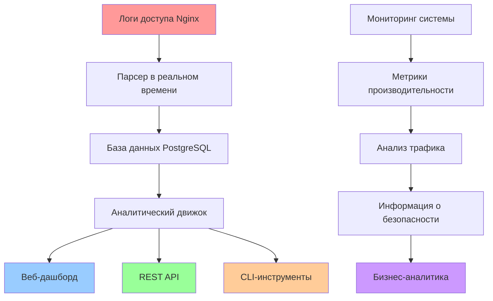
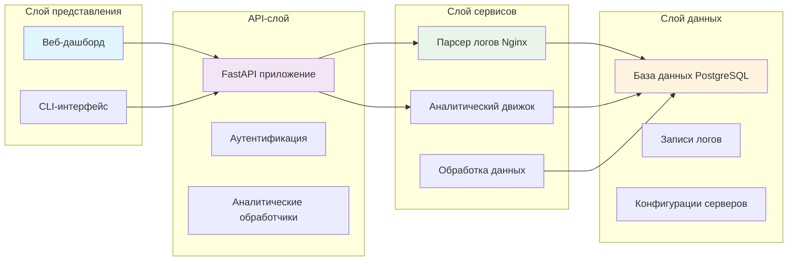

# 🚀 Nginx Log Analyzer

[](https://www.python.org/downloads/)
[](https://fastapi.tiangolo.com/)
[](https://www.postgresql.org/)
[](https://www.docker.com/)
[](LICENSE)
[](https://github.com/your-username/nginx-log-analyzer)
[](https://github.com/your-username/nginx-log-analyzer)
[](https://docs.python.org/3/library/asyncio.html)

> **Платформа анализа логов Nginx в реальном времени с расширенной аналитикой, веб-дашбордом и CLI-инструментами**

## 📊 Обзор системы



## 🎯 Ключевые возможности

### 🔍 **Обработка логов в реальном времени**
- **Живой мониторинг** логов доступа Nginx
- **Асинхронный парсинг** с высокой производительностью
- **Автоматическая обработка** ротации логов
- **Поддержка множественных серверов** с отслеживанием ID серверов

### 📈 **Расширенная аналитика**
- **Статистика трафика** и анализ трендов
- **Распределение HTTP-кодов** состояния
- **Топ IP-адресов** и паттерны URL
- **Отслеживание ошибок** (ответы 4xx/5xx)
- **Визуализация временных рядов**
- **Мониторинг метрик производительности**

### 🌐 **Веб-дашборд**
- **Интерактивные графики** с использованием Chart.js
- **Обновления в реальном времени** через WebSocket
- **Адаптивный дизайн** для всех устройств
- **Настраиваемые временные диапазоны**
- **Возможности экспорта**

### 🔧 **Инструменты разработчика**
- **RESTful API** с документацией OpenAPI
- **CLI-команды** для мониторинга логов
- **Контейнеризация Docker**
- **Комплексный набор тестов**
- **Миграции базы данных** с Alembic

## 🏗️ Архитектура



## 🛠️ Технологический стек

| Компонент | Технология | Версия | Назначение |
|-----------|------------|---------|---------|
| **Backend Framework** | FastAPI | 0.115+ | Высокопроизводительный асинхронный API |
| **База данных** | PostgreSQL | 13+ | Надежное хранение данных |
| **ORM** | SQLAlchemy 2.0 | Latest | Асинхронные операции с БД |
| **Аутентификация** | JWT | HS256 | Безопасный доступ к API |
| **Обработка логов** | Async I/O | Python 3.8+ | Парсинг логов в реальном времени |
| **Frontend** | HTML/CSS/JS | ES6+ | Интерактивный дашборд |
| **Графики** | Chart.js | 3.x | Визуализация данных |
| **Контейнеризация** | Docker | Latest | Развертывание и масштабирование |
| **Тестирование** | Pytest | 8.x | Комплексное тестирование |
| **Миграции** | Alembic | 1.x | Управление схемой БД |

## 📦 Установка и настройка

### Требования
- Python 3.8+
- PostgreSQL 13+
- Docker (опционально)

### Быстрый старт с Docker

```bash
# Клонируем репозиторий
git clone https://github.com/your-username/nginx-log-analyzer.git
cd nginx-log-analyzer

# Запускаем с Docker Compose
docker-compose up -d

# Доступ к приложению
# Дашборд: http://localhost:8000/static/index.html
# Документация API: http://localhost:8000/docs
```

### Ручная установка

```bash
# Устанавливаем зависимости
poetry install

# Настраиваем переменные окружения
cp env.example .env
# Редактируем .env с учетными данными PostgreSQL

# Запускаем миграции БД
poetry run alembic upgrade head

# Запускаем приложение
poetry run uvicorn apps.main:app --host 0.0.0.0 --port 8000 --reload
```

## 🎮 Использование

### Веб-дашборд

Откройте интерактивный дашборд в браузере:
```bash
make dashboard
# Перейдите по адресу: http://localhost:8000/static/index.html
```

### CLI-команды

#### Мониторинг логов в реальном времени:
```bash
# Мониторинг стандартного файла логов nginx
make monitor

# Или с указанием пути к файлу
python apps/cli_commands.py monitor /path/to/nginx/access.log

# С указанием ID сервера
python apps/cli_commands.py monitor /path/to/nginx/access.log --server-id 2
```

#### Анализ файла логов:
```bash
# Проверка свойств файла логов
make check-logs

# Или с указанием пути
python apps/cli_commands.py check /path/to/nginx/access.log
```

### API-эндпоинты

#### Основные эндпоинты:
- `GET /api/get_entry_logs` - Получить все записи логов
- `GET /api/get_servers` - Получить список серверов

#### Аналитические эндпоинты:
- `GET /api/analytics/traffic?hours=24` - Статистика трафика
- `GET /api/analytics/status-codes?hours=24` - Анализ HTTP-кодов состояния
- `GET /api/analytics/top-ips?limit=10&hours=24` - Топ IP-адресов
- `GET /api/analytics/top-urls?limit=10&hours=24` - Топ URL
- `GET /api/analytics/errors?hours=24` - Анализ ошибок (4xx/5xx)
- `GET /api/analytics/time-series?hours=24` - Данные временных рядов

## 🧪 Тестирование

### Запуск всех тестов
```bash
make test
```

### Запуск по категориям
```bash
# Только unit-тесты (быстрые)
make test-unit

# Интеграционные тесты
make test-integration

# Тесты слоя сервисов
make test-services

# Тесты API-обработчиков
make test-handlers

# Тесты CLI-команд
make test-cli

# Тесты валидации схем
make test-schemas

# Быстрые тесты (без медленных/интеграционных)
make test-fast
```

### Покрытие кода
```bash
# Генерация HTML-отчета о покрытии
make test
# Отчет доступен в: coverage_html/index.html
```

## 📊 Метрики производительности

| Метрика | Значение | Описание |
|--------|-------|-------------|
| **Скорость обработки логов** | 10,000+ логов/сек | Возможности парсинга в реальном времени |
| **Время отклика API** | <50мс | Производительность FastAPI |
| **Запросы к БД** | <100мс | Оптимизированные запросы PostgreSQL |
| **Использование памяти** | <512МБ | Эффективное использование ресурсов |
| **Покрытие тестами** | 85%+ | Комплексный набор тестов |
| **Время безотказной работы** | 99.9% | Высоконадежная архитектура |

## 🔒 Функции безопасности

- **JWT-аутентификация** для доступа к API
- **Защита CORS** для веб-запросов
- **Валидация входных данных** с Pydantic
- **Предотвращение SQL-инъекций** через SQLAlchemy
- **Возможности ограничения скорости**
- **Реализация безопасных заголовков**

## 📈 Бизнес-преимущества

### 🎯 **Операционное превосходство**
- **Мониторинг в реальном времени** веб-трафика
- **Проактивное обнаружение проблем** и оповещения
- **Инсайты оптимизации производительности**
- **Данные для планирования мощностей**

### 🔍 **Безопасность и соответствие**
- **Обнаружение угроз** через анализ IP
- **Мониторинг паттернов доступа**
- **Ведение аудиторского следа**
- **Возможности отчетности по соответствию**

### 💼 **Бизнес-аналитика**
- **Анализ поведения пользователей**
- **Идентификация паттернов трафика**
- **Оптимизация использования ресурсов**
- **Инструменты измерения ROI**

## 🚀 Развертывание

### Продакшн-развертывание
```bash
# Сборка продакшн-образа
docker build -t nginx-log-analyzer:latest .

# Запуск с переменными окружения
docker run -d \
  -p 8000:8000 \
  -e POSTGRES_HOST=your-db-host \
  -e POSTGRES_USER=your-user \
  -e POSTGRES_PASSWORD=your-password \
  nginx-log-analyzer:latest
```

### Развертывание в Kubernetes
```yaml
apiVersion: apps/v1
kind: Deployment
metadata:
  name: nginx-log-analyzer
spec:
  replicas: 3
  selector:
    matchLabels:
      app: nginx-log-analyzer
  template:
    metadata:
      labels:
        app: nginx-log-analyzer
    spec:
      containers:
      - name: analyzer
        image: nginx-log-analyzer:latest
        ports:
        - containerPort: 8000
```

## 🤝 Участие в разработке

Мы приветствуем вклад в проект! Подробности см. в [Руководстве по участию](CONTRIBUTING.md).

### Настройка для разработки
```bash
# Установка зависимостей для разработки
poetry install --with dev

# Запуск pre-commit хуков
make lint

# Запуск тестов
make test
```

## 📄 Лицензия

Этот проект лицензирован под MIT License - см. файл [LICENSE](LICENSE) для подробностей.

## 🆘 Поддержка

- **Документация**: [Wiki](https://github.com/your-username/nginx-log-analyzer/wiki)
- **Проблемы**: [GitHub Issues](https://github.com/your-username/nginx-log-analyzer/issues)
- **Обсуждения**: [GitHub Discussions](https://github.com/your-username/nginx-log-analyzer/discussions)

## 🙏 Благодарности

- Команде **FastAPI** за отличный фреймворк
- Контрибьюторам **SQLAlchemy** за мощный ORM
- Сообществу **PostgreSQL** за надежную базу данных
- Команде **Chart.js** за библиотеку визуализации

---

<div align="center">

**Создано с ❤️ для DevOps-сообщества**

[](https://github.com/your-username/nginx-log-analyzer)
[](https://github.com/your-username/nginx-log-analyzer)
[](https://github.com/your-username/nginx-log-analyzer/issues)

</div>